## Course information

- University of Tübingen
- Summer semester 2023
- Seminar (Hauptseminar)

## Overview

Ultradound imaging can be used in articulatory phonetics by recording tongue shapes along time as is below:

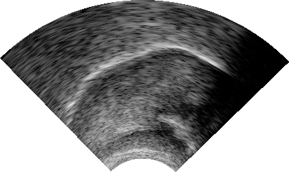

1. How does ultrasound imaging work?
2. How can ultrasound images be analyzed?
3. What are advantages and disadvantages of ultrasound imaging?
4. Which tongue muscles are involved in making which linguistic sounds?

These questions were covered in the course. In addition, an overview of theoretical linguistic fields and psycholinguisitc fields were also included for those who were relatively new to linguistics. The first and second bullet points mentioned above are briefly explained below.

## Mechanism of ultasound imaging

Ultrasound imaging makes use of sound waves, as the name suggests. Speed of sounds differs from material to material in which it travels through. When sound waves go from one medium to another, and if these media allow sound waves to be trasmitted by different speeds, some of them get transmitted to the next medium while some others get reflected. If you measure how long a sound wave takes since being emitted until returning, you can figure out the distance it traveled. This is basically how ultrasound imaging works.

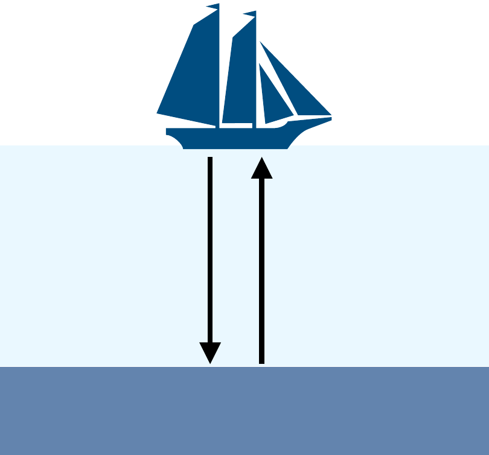

## Analysis techniques of ultrasound images

There have been several different ways of analyzing ultraound images proposed in the literature. They can be divided into two major cateogires:

1. Tongue-surface analysis

2. Whole-image analysis

### Tongue surface analysis

Tongue surface anaylsis is based on bright pixels that should correpond to the tongue surface:

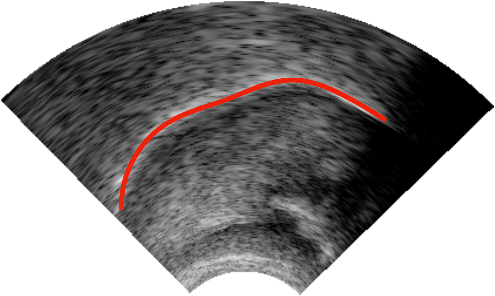

Tongue surfaces across multiple ultrasound images are often semi-automatically detected by a software (i.e., edge detection).

Some studies try to summarize the shape of the tongue surface contour by a representative value. For example, a single point (e.g., the highest point) can be taken as a representative value for the shape, as below, for example:

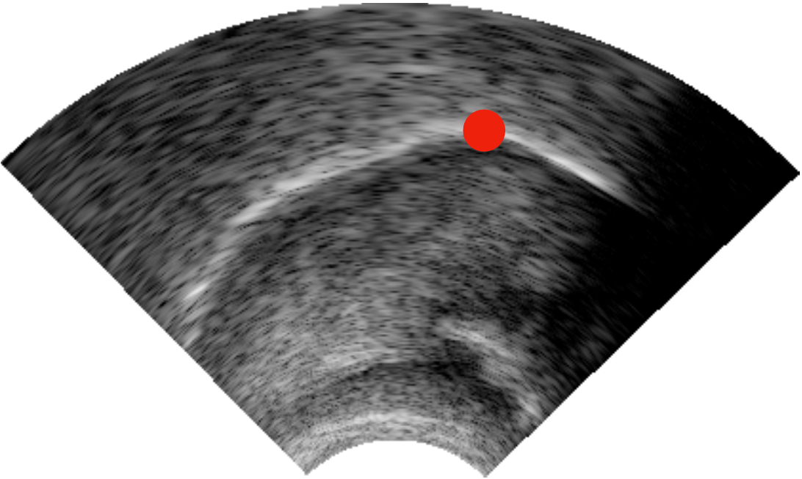

Other summarizing techniques include approximation by a triangle, quantification of a curve by a curvature index, the Procrustes analysis, and Discrete Fourier Transform.

One common method in this category (i.e., the tongue-surface analysis) is called "Smoothing-Spline ANOVA". This technique fits smoothed curves onto coordinates of bright pixels that correspond to the tongue surface and test where significant differences are located along some sets of tongue surface curves.

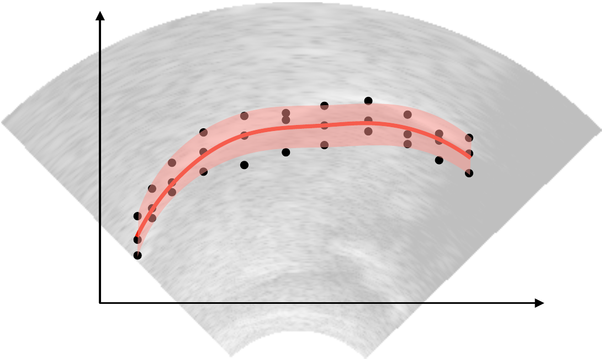

This line of analysis has been extended by Generalized Additive Models (GAMs). In the following schematic illustlation, warmer colors are intended to represent higher tongue positions, while colder colors lower tongue positions. For each time point (namely each vertical slice of the image below), you can think of a smoothed curve (as you would see in Smoothing-Spline ANOVA). Such smoothed curves change along time, as you go from left to right in the image below. This technique essentially extended Smoothing-Spline ANOVA and allows the analysis to investigate tongue "movements", beyond a simple comparison of two tongue surface curves.

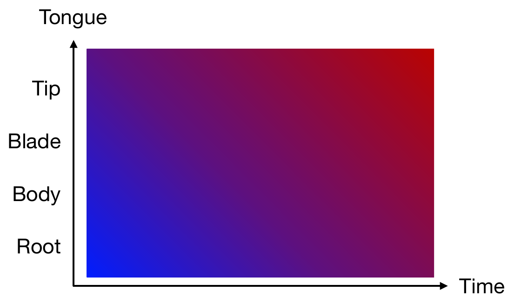

### Whole image analysis

In contrast to these techniques focusing on tongue surface curves, some other studies have sought a way of integrating all the information in an ultrasound image. One of such methods is to take into account pixel-wise Euclidean distances between two ultrasound images. Smaller differences in pixel brightness levels would indicate similar appearances of ultrasound images.

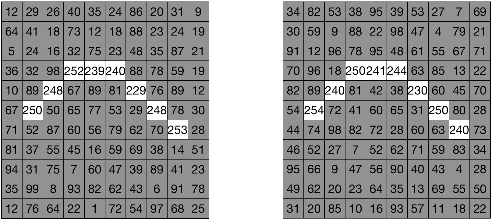

Another study [^1] integrated time into the whole-word analysis by fitting GAM on pixel brightness levels as the dependent variable as a function of their x- and y-coordinates. Since GAMs are a generalized version of simple regression, additional variables can be added, including time. This method allows to estimate pixel brightness values for each combination of x- and y-coordinates with confidence intervals. In other words, GAMs provide *predicted ultrasound images*, which can be seen to the right side of the figure below. By including time as an additional variable, changes of (predicted) ultrasound images can be produced.

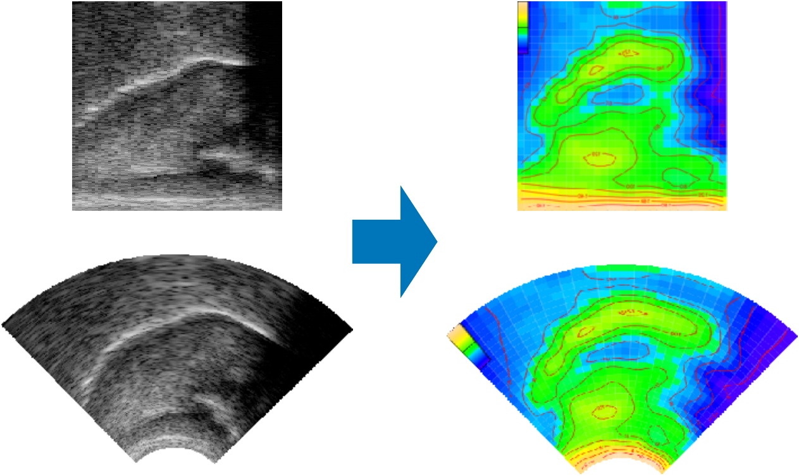

[^1]: This analysis method was developed by me and Prof. Dr. Harald Baayen. For more details, please refer to the following paper:

    - Saito, M., Tomaschek, F., Sun, C.-C., & Baayen, R. H. (2024). Articulatory effects of frequency modulated by semantics. In M. Schlechtweg (Ed.), Interfaces of phonetics (pp. 125–154). De Gruyter Mouton. https://doi.org/doi:10.1515/9783110783452-005

  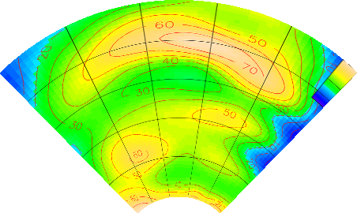
  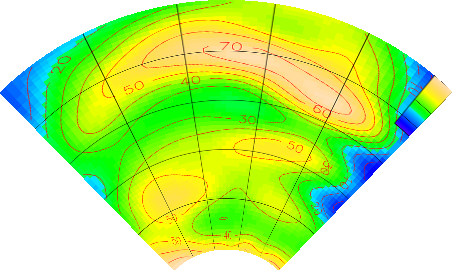
  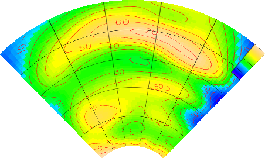
  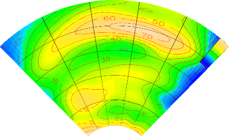
  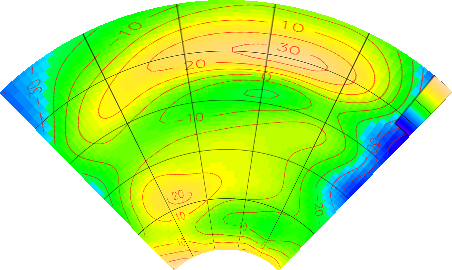

