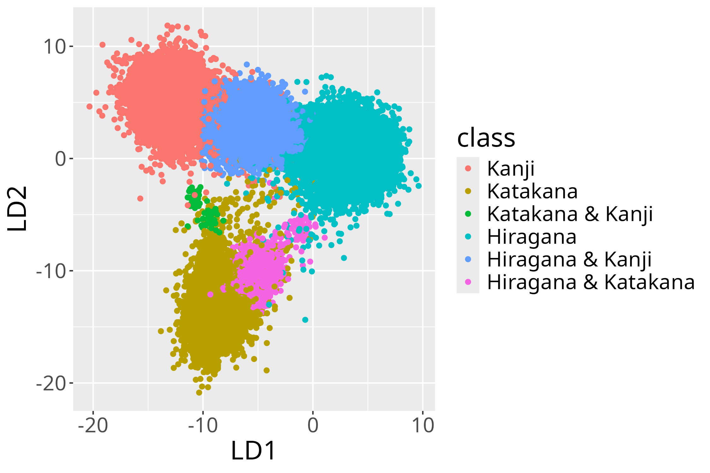

<!--- Comment out to display a highlighted block of text:
{}
Click on the **Slides** button above to view the built-in slides feature.
{}
-->

<!---
Slides can be added in a few ways:

- **Create** slides using Hugo Blox Builder's [_Slides_](https://docs.hugoblox.com/reference/content-types/) feature and link using `slides` parameter in the front matter of the talk file
- **Upload** an existing slide deck to `static/` and link using `url_slides` parameter in the front matter of the talk file
- **Embed** your slides (e.g. Google Slides) or presentation video on this page using [shortcodes](https://docs.hugoblox.com/reference/markdown/).

Further event details, including [page elements](https://docs.hugoblox.com/reference/markdown/) such as image galleries, can be added to the body of this page.
-->

## Abstract:
Is meaning expressed in the details of the realization of words? This is some evidence that this is true (Schmitz & Baer-Henney, 2024, Berg et al., 2023). This leads one to expect that this should also hold for writing systems.

We focused on Japanese, which mixes three different writing systems. We hypothesized that if the choice of a writing system is affected by the meaning, we can predict a writing system of a word given its meaning.

We collected 383392 words from the Japanese CHILDES corpora (Miyata, 2012). For each word a contextualized embedding was calculated (Devlin et al., 2018). We tested our hypothesis by training a DLM model (Baayen et al., 2019) to predict the writing system of a word on the basis of its meaning.

The prediction accuracy of the model was 94.6%, and an LDA was performed to predict the writing system of each word given its meaning (Figure 1). Our analyses show that semantics has information affecting a word’s writing system.

Figure 1: Coefficients of the LDA analysis. The red data points represent words written in kanji. The turquoise data points are words written in hiragana. The yellow-brown data points are words written in katakana.

## Notes:

This is a presentation about semantic effects on Japanese writing systems with Prof. Dr. Ruben van de Vijver (University of Düsseldorf).

